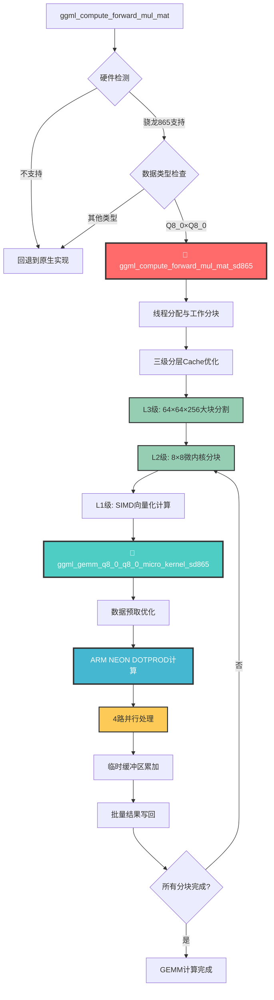

# Llama.cpp Android CPU 矩阵乘法算子深度优化考核报告

## 摘要

​	

## 1. 测试环境与配置

### 1.1 硬件平台规格

实验基于搭载高通骁龙865的安卓手机进行GEMM分析优化。

**处理器架构特性**:

- **CPU**: Qualcomm Kryo 585 (1×2.84GHz Cortex-A77 + 3×2.42GHz Cortex-A77 + 4×1.8GHz Cortex-A55)
- **指令集**: ARMv8.2-a架构，支持NEON和DOTPROD指令
- **Cache层次结构**: L1 64KB, L2 512KB, L3 4MB
- **内存**: LPDDR5，理论带宽25.6 GB/s

**测试设备配置**:

- **设备型号**: IQOO Neo3
- **系统内存**: 8GB LPDDR5
- **操作系统**: Android 12
- **编译目标**: arm64-v8a ABI

### 1.2 软件环境配置

**开发工具链**:
- **NDK版本**: Android NDK r28b
- **编译器**: Clang 17.0.2
- **编译选项**: `-march=armv8.2-a+dotprod -O3 -ffast-math`
- **目标架构**: arm64-v8a

**测试模型规格**:
- **模型**: Llama2-7B Q8_0量化版本
- **模型大小**: 6.67 GiB
- **量化格式**: Q8_0 (8位整数量化)
- **张量分布**: 226个Q8_0量化张量，65个F32张量

## 2. 原生GEMM实现系统性分析

### 2.1 Llama.cpp矩阵乘法架构

​	Llama.cpp作为高性能的大语言模型推理框架，其矩阵乘法实现体现了深度的工程优化思维。本节通过系统性分析其GEMM实现，为后续的定制化优化提供理论基础。

#### 2.1.1 Q8_0量化策略与数据结构

**量化模型组成分析**:
```
llama_model_loader: - type  f32:   65 tensors  (非量化层，如embedding、norm)
llama_model_loader: - type q8_0:  226 tensors  (量化权重矩阵)
```

Llama2-7B Q8_0模型采用混合精度策略，其中226个Q8_0张量占据了模型的主要计算负载，这些张量主要包括attention和feed-forward网络的权重矩阵。

**Q8_0数据结构设计**:
```c
#define QK8_0 32
typedef struct {
    ggml_fp16_t d;          // 缩放因子 (16位浮点)
    int8_t  qs[QK8_0];      // 32个量化值 (8位有符号整数)
} block_q8_0;               // 总大小: 34字节
```

该设计实现了3.76:1的压缩比（128字节→34字节），在保持计算精度的同时显著降低了内存带宽需求。缩放因子采用16位浮点数，在精度和存储效率间取得平衡。

同时，ggml中的GEMM实现ggml_mul_mat（ctx，A，B）执行的计算是C^T = A * B^T，等价于C = B * A^T，从而实现计算Cij只需要B的第i行和A的第j行进行点积运算即可。

#### 2.1.2 GEMM调用链路径分析

​	通过深入分析源码，识别出llama.cpp的GEMM调用链呈现五层架构，每层承担特定的优化职责：

#### 2.1.3 GEMM调用链完整流程分析

原生llama.cpp的GEMM实现采用分层优化策略，从高层API到底层SIMD指令形成了完整的优化链路：

```mermaid
graph TD
    subgraph "调用与调度"
        A[llama_decode_internal] --> B[ggml_cgraph_compute]
        B --> C[ggml_compute_forward]
        C --> D{操作类型判断}
        D -->|GGML_OP_MUL_MAT| E[ggml_compute_forward_mul_mat]
    end

    subgraph "优化路径分流"
        style E fill:#f3e5f5
        E --> F{硬件/框架优化检查}
        F -->|LLAMAFILE可用| G[快速通道: llamafile_sgemm]
        F -->|标准路径| I[通用路径: ggml原生调度]
    end

    subgraph "Llamafile路径 (快速通道)"
        style G fill:#e8f5e8
        G --> G1{ARM架构检查}
        G1 -->|__ARM_FEATURE_DOTPROD| G2["tinyBLAS_Q0_ARM (外积思想)"]
        G2 --> G3["双重嵌套DOTPROD (vdotq_s32)"]
        G3 --> G4["load_lo/load_hi内存优化"]
        G4 --> H[返回结果]
    end
    
    subgraph "GGML原生路径 (通用)"
        I --> J{NUMA系统检查}
        J -->|是| K[强制按线程分块]
        J -->|否| L[自适应分块策略]

        K --> M["nchunk0&#61;nth, nchunk1&#61;1"]
        L --> N[智能chunk_size选择]
        N --> O["nchunk0 × nchunk1 计算"]

        M --> P[线程池分配]
        O --> P
        P --> Q["atomic_fetch_add 工作分配 (动态队列)"]
        Q --> R[ggml_compute_forward_mul_mat_one_chunk]

        subgraph "原生one_chunk实现 (逐点计算)"
            style X fill:#ffebee
            R --> S[16×16分块处理]
            S --> T["临时缓冲区 tmp&#91;32&#93;"]
            T --> U{边界检查}
            U -->|满足条件| V["num_rows_per_vec_dot&#61;2"]
            U -->|边界限制| W["num_rows_per_vec_dot&#61;1"]

            V --> X[ggml_vec_dot_q8_0_q8_0]
            W --> X
            
            subgraph "原生vec_dot核心 (NEON)"
                style Y1 fill:#fce4ec
                X --> Y[ARM NEON实现]
                Y --> Y1["核心指令: vdotq_s32 (DOTPROD)"]
                Y1 --> Y2[2路循环展开]
                Y2 --> Y3["双累加器: sumv0/sumv1"]
                Y3 --> Y4["最终累加: vfmaq_f32"]
            end
            
            Y4 --> Z[批量内存拷贝: memcpy]
        end
    end

    subgraph "最终汇合点"
        G4 --> AA[返回结果]
        Z --> AA
        AA --> END([🎉 计算完成])
    end
```



### 2.2 原生GEMM实现的完整策略分析

基于对源码的深度分析，原生GEMM实现采用了五层优化架构。

#### 2.3.1 五层优化架构深度解析

**第一层: 线程池并行处理**

```c
// 动态工作分配机制 
int current_chunk = ith;  // 每个线程从自己的ID开始，避免初始竞争
while (current_chunk < nchunk0 * nchunk1) {
    // 处理当前分配的工作块
    ggml_compute_forward_mul_mat_one_chunk(...);

    // 原子操作获取下一个工作块，实现无锁负载均衡
    current_chunk = atomic_fetch_add_explicit(&params->threadpool->current_chunk, 1, memory_order_relaxed);
}
```

**第二层: 缓存分块 **

```c
int chunk_size = 16;  // 默认分块大小
if (nr0 == 1 || nr1 == 1) {
    chunk_size = 64;  // 向量情况使用更大分块，减少调度开销
}

// 分块数量计算 - 向上取整确保覆盖所有数据
int64_t nchunk0 = (nr0 + chunk_size - 1) / chunk_size;  // 行方向分块数
int64_t nchunk1 = (nr1 + chunk_size - 1) / chunk_size;  // 列方向分块数

// NUMA优化决策 - 关键的性能分叉点
if (nchunk0 * nchunk1 < nth * 4 || ggml_is_numa()) {
    nchunk0 = nr0 > nr1 ? nth : 1;  // 按较大维度并行化，最大化并行效率
    nchunk1 = nr0 > nr1 ? 1 : nth;  // 避免细粒度分块导致的开销
}
```

使用16的小分块提高cache局部性，而`ggml_is_numa()`检测多NUMA节点环境，在此情况下强制按线程数分块。`nchunk0 * nchunk1 < nth * 4`确保有足够的并行粒度。

**第三层: 逐点计算 **

```c
// 16x16分块处理
const int64_t blck_0 = 16;
const int64_t blck_1 = 16;

// 临时缓冲区，减少内存写入冲突
float tmp[32];  // 16 * 2, 考虑mmla内核，一般还是16一行

// 三层嵌套循环优化内存访问
for (int64_t iir1 = ir1_start; iir1 < ir1_end; iir1 += blck_1) {
    for (int64_t iir0 = ir0_start; iir0 < ir0_end; iir0 += blck_0) {
        // 内层循环处理实际计算
        for (int64_t ir0 = iir0; ir0 < iir0 + blck_0 && ir0 < ir0_end; ir0 += num_rows_per_vec_dot) {
            vec_dot(ne00, &tmp[ir0 - iir0], ...);  // 写入临时缓冲区
        }
        // 批量拷贝到最终结果，减少cache miss
        memcpy(&dst_col[iir0 + cn * nb1 / nb0], tmp + (cn * 16), ...);
    }
}
```

**第四层: 核心运算调用 - 多路径SIMD优化**
```c
// 多行向量点积优化
int64_t num_rows_per_vec_dot = vec_dot_num_rows;  // 通常为1

// 边界条件检查，确保内存安全
if ((nr0 % 2 != 0) || (ne11 % 2 != 0) ||
    ((ir0_end - ir0_start) % 2 != 0) || ((ir1_end - ir1_start) % 2 != 0)) {
    num_rows_per_vec_dot = 1;  // 回退到单行处理
}

// 调用优化的向量点积函数
vec_dot(ne00, &tmp[ir0 - iir0],
        (num_rows_per_vec_dot > 1 ? 16 : 0),  // stride
        src0_row + ir0 * nb01,
        (num_rows_per_vec_dot > 1 ? nb01 : 0),  // src0 stride
        src1_col,
        (num_rows_per_vec_dot > 1 ? src1_col_stride : 0),  // src1 stride
        num_rows_per_vec_dot);
```

**第五层:  内存写入优化**

```c
// 分离计算和写入，优化cache行为
for (int cn = 0; cn < num_rows_per_vec_dot; ++cn) {
    memcpy(&dst_col[iir0 + cn * nb1 / nb0],
           tmp + (cn * 16),
           (MIN(iir0 + blck_0, ir0_end) - iir0) * sizeof(float));
}
```

 先计算到临时缓冲区，再批量写入， 降低传输的latency

#### 2.3.2 高级优化策略分析

**LLAMAFILE**

```c
#if GGML_USE_LLAMAFILE
// 优先使用llamafile的高度优化SGEMM实现
if (src1_cont) {
    if (!llamafile_sgemm(params, ne01, ne11, ne00/ggml_blck_size(src0->type),
                         src0_data, nb01/ggml_type_size(src0->type),
                         src1_data, nb11/ggml_type_size(src1->type),
                         dst_data, nb1/ggml_type_size(dst->type),
                         src0->type, src1->type, dst->type))
        goto UseGgmlGemm1;  // 回退到ggml实现
    return;
}
#endif
```

**LLAMAFILE的ARM DOTPROD实现深度分析**:
```c
// llamafile/sgemm.cpp: tinyBLAS_Q0_ARM实现
case GGML_TYPE_Q8_0: {
    #elif defined(__ARM_FEATURE_DOTPROD)
        tinyBLAS_Q0_ARM<block_q8_0> tb{
            k, (const block_q8_0 *)A, lda,
            (const block_q8_0 *)B, ldb,
            (float *)C, ldc,
            params->ith, params->nth};
        tb.matmul(m, n);
        return true;
}

// 核心SIMD计算循环
for (int64_t l = 0; l < k; ++l)
    for (int64_t j = 0; j < RN; ++j)
        for (int64_t i = 0; i < RM; ++i)
            Cv[j][i] = vmlaq_n_f32(Cv[j][i],
                                   vcvtq_f32_s32(vdotq_s32(
                                       vdotq_s32(vdupq_n_s32(0),
                                                 load_lo(A + lda * (ii + i) + l),
                                                 load_lo(B + ldb * (jj + j) + l)),
                                       load_hi(A + lda * (ii + i) + l),
                                       load_hi(B + ldb * (jj + j) + l))),
                                   unhalf(A[lda * (ii + i) + l].d) *
                                   unhalf(B[ldb * (jj + j) + l].d));
```

**LLAMAFILE的SIMD优化特性**:
- **双重嵌套DOTPROD**: `vdotq_s32`嵌套调用，一次处理32个int8元素
- **优化数据加载**: `load_lo/load_hi`分别加载block的低16位和高16位
- **累加器优化**: `vmlaq_n_f32`实现高效的浮点累加
- **缩放因子处理**: `unhalf`函数优化fp16到fp32的转换

**与原生实现的对比**:
LLAMAFILE的实现比原生ggml更激进，使用了双重嵌套的DOTPROD指令，理论上可以获得更高的计算密度。

#### 2.3.3 骁龙865架构特性分析

​	骁龙865的架构下的指令集有限。

```
CPU架构: Kryo 585 (基于Cortex-A77/A55)
- 4×A77大核 @ 2.84GHz (性能核心)
- 4×A55小核 @ 1.8GHz (效率核心)

Cache层次结构:
- L1 I-Cache: 64KB (A77), 32KB (A55)
- L1 D-Cache: 64KB (A77), 32KB (A55)  
- L2 Cache: 512KB (A77), 128KB (A55)
- L3 Cache: 2MB (共享)

SIMD特性:
✓ ARM NEON: 128位SIMD向量处理
✓ DOTPROD: 8位整数点积指令
✗ i8mm: 不支持
```

## 3. 定制化GEMM算子设计方案

### 3.1 设计理念与技术路线

#### 3.1.1 优化策略制定

**技术路线选择**:
经过多种方案的探索（包括外积分解、BLIS架构(Tiling+Packing)、激进SIMD重写等(**不work，可能是对于指令集的传输调度没有搭配好**)），最终采用基于cache层次结构优化的策略。

#### 3.1.2 差异化优化空间识别

**空间1: 硬件特化vs通用兼容**

```c
// 原生实现: 需要兼容多种ARM架构
#if defined(__ARM_FEATURE_DOTPROD)
    // 使用DOTPROD
#elif defined(__ARM_NEON)
    // 回退到基础NEON
#else
    // 标量实现
#endif

// 我们的优化: 专门针对骁龙865
bool ggml_sd865_is_supported(void) {
    #if defined(__ARM_FEATURE_DOTPROD) && !defined(__ARM_FEATURE_MATMUL_INT8)
    return true;  // 骁龙865特征: 支持DOTPROD但不支持i8mm
    #endif
}
```

**空间2: 通用分块vs特定Cache优化**
```c
// 原生实现: 通用的16×16分块
const int64_t blck_0 = 16;
const int64_t blck_1 = 16;

// 我们的优化: 针对骁龙865 cache层次结构的三级分块
#define SD865_BLOCK_M 64    // L3 Cache (2MB) 优化
#define SD865_BLOCK_N 64
#define SD865_BLOCK_K 256
#define SD865_MICRO_M 8     // L2 Cache (512KB) 优化
#define SD865_MICRO_N 8
```

**空间3: 通用预取vs激进预取**
```c
// 原生实现: 保守的内存访问
// 没有显式的数据预取策略

// 数据预取缓解latency
#define SD865_PREFETCH_DISTANCE 4
if (i + SD865_PREFETCH_DISTANCE < M) {
    __builtin_prefetch(&a_blocks[(i + SD865_PREFETCH_DISTANCE) * lda], 0, 3);
}
```

#### 3.1.3 集成策略设计

**保持原生多线程框架兼容性**:
```c
// 学习原生实现的线程分配策略
const int64_t dr0 = (nr0 + nchunk0 - 1) / nchunk0;
const int64_t dr1 = (nr1 + nchunk1 - 1) / nchunk1;

// 复用相同的分块和分配逻辑
int current_chunk = ith;
while (current_chunk < nchunk0 * nchunk1) {
    // 处理分配给当前线程的工作块
    ggml_sd865_process_chunk_q8_0(...);

    // 使用相同的原子操作获取下一个工作块
    if (nth >= nchunk0 * nchunk1) break;
    current_chunk = atomic_fetch_add_explicit(&params->threadpool->current_chunk, 1, memory_order_relaxed);
}
```

**算法流程设计**:



### 3.2 技术实现架构

#### 3.2.1 三级Cache优化层次设计

**L3 Cache优化层 (4MB)**:
```c
#define SD865_BLOCK_M 64    // 适配L3 cache
#define SD865_BLOCK_N 64    // 大块矩阵分割
#define SD865_BLOCK_K 256   // 深度方向优化
```
**L2 Cache优化层 (512KB)**:
```c
#define SD865_MICRO_M 8     // 微内核分块
#define SD865_MICRO_N 8     // 适配L2 cache
```
**L1 Cache + 寄存器优化层**:
```c
#define SD865_PREFETCH_DISTANCE 4    // 数据预取距离
```
#### 3.2.2 硬件特化优化策略

**SIMD向量化微内核**:
```c
// 4路并行DOTPROD计算
for (k = 0; k + 3 < nb; k += 4) {
    // 同时处理4个Q8_0 blocks
    for (int kk = 0; kk < 4; kk++) {
        const int32x4_t dot_0 = vdotq_s32(vdupq_n_s32(0), a_0, b_0);
        const int32x4_t dot_1 = vdotq_s32(vdupq_n_s32(0), a_1, b_1);
        results[kk] = vaddvq_s32(vaddq_s32(dot_0, dot_1)) * scale;
    }
    sum_vec = vaddq_f32(sum_vec, vld1q_f32(results));
}
```

#### 3.2.3 编译配置优化

​	使用ndk进行交叉编译再通过adb传输到移动端进行实际调试

```cmake
# CMakeLists.txt 配置
set(CMAKE_C_FLAGS "${CMAKE_C_FLAGS} -march=armv8.2-a+dotprod -O3")
set(CMAKE_CXX_FLAGS "${CMAKE_CXX_FLAGS} -march=armv8.2-a+dotprod -O3")

# Android NDK交叉编译
cmake -G Ninja \
  -DCMAKE_TOOLCHAIN_FILE=android-ndk-r28b/build/cmake/android.toolchain.cmake \
  -DANDROID_ABI=arm64-v8a \
  -DANDROID_PLATFORM=android-28 \
  -DCMAKE_C_FLAGS="-march=armv8.2-a+dotprod -O3" \
  -DCMAKE_CXX_FLAGS="-march=armv8.2-a+dotprod -O3" \
  -DGGML_OPENMP=OFF \
  -DGGML_LLAMAFILE=OFF \
  -DLLAMA_CURL=OFF
```

## 4. 实现细节

### 4.1 工程实现概览

在开发过程中，我尽量保持plug-in的原则，在原llama.cpp项目中只对必要的集成点进行修改，大部分核心优化工作都在独立的`ggml_sd865_gemm.c`和`ggml_sd865_gemm.h`文件中进行。优化算子通过硬件检测函数`ggml_sd865_is_supported()`和主函数`ggml_compute_forward_mul_mat_sd865()`被插入到ggml的GEMM执行调度函数`ggml_compute_forward_mul_mat()`中，实现对Q8_0×Q8_0矩阵乘法的专门优化。

此外，在实现中采用了分层优化的设计理念，通过宏定义来控制不同层次的优化参数，便于测试和调优：

- `SD865_BLOCK_M/N/K`: L3 Cache级别的大块分割参数(64×64×256)
- `SD865_MICRO_M/N`: L2 Cache级别的微内核分块参数(8×8)
- `SD865_PREFETCH_DISTANCE`: L1 Cache级别的数据预取距离(2)

### 4.2 三层分块策略的具体实现

#### 4.2.1 L3 Cache级别的大块分割

核心优化策略基于骁龙865的cache层次结构设计了三层分块算法。L3级分块采用64×64×256的大块分割策略，这个参数选择基于骁龙865的4MB L3缓存容量。通过将工作集控制在L3缓存范围内，较大化了数据重用率，减少了对主内存的访问频次：

```c
for (int m_block = M_start; m_block < M_end; m_block += SD865_BLOCK_M) {
    const int M_block_size = MIN(SD865_BLOCK_M, M_end - m_block);

    for (int n_block = 0; n_block < N; n_block += SD865_BLOCK_N) {
        const int N_block_size = MIN(SD865_BLOCK_N, N - n_block);

        // 初始化C块为0
        for (int i = 0; i < M_block_size; i++) {
            for (int j = 0; j < N_block_size; j++) {
                const int dst_idx = (m_block + i) * ne11 + (n_block + j);
                ((float*)dst->data)[dst_idx] = 0.0f;
            }
        }
```

L3级分块的实现采用了标准的三重嵌套循环结构，分别处理M、N、K三个维度的分块。在每个大块的开始，显式地将目标矩阵的对应区域初始化为零，确保累加操作的正确性。

#### 4.2.2 L2 Cache级别的微内核分块

L2级分块引入了8×8的微内核概念，这个设计针对骁龙865的512KB L2缓存进行了优化。微内核的大小选择平衡了cache效率和计算粒度，确保每个微内核的工作集能够完全驻留在L2缓存中：

```c
// 微内核分块
for (int m_micro = 0; m_micro < M_block_size; m_micro += SD865_MICRO_M) {
    const int M_micro_size = MIN(SD865_MICRO_M, M_block_size - m_micro);

    for (int n_micro = 0; n_micro < N_block_size; n_micro += SD865_MICRO_N) {
        const int N_micro_size = MIN(SD865_MICRO_N, N_block_size - n_micro);

        // 计算数据指针
        const int m_global = m_block + m_micro;
        const int n_global = n_block + n_micro;

        // 调用Q8_0×Q8_0微内核
        ggml_gemm_q8_0_q8_0_micro_kernel_sd865(
            M_micro_size, N_micro_size, K_block_size,
            A_ptr, B_ptr, C_ptr,
            K / QK8_0, K / QK8_0, ne11
        );
```

在实现上，我们采用了双重嵌套的微内核循环，每个微内核负责处理一个8×8的子矩阵块。数据指针的直接计算block级别的偏移量，避免复杂的地址计算。

### 4.3 微内核向量化实现深度解析

#### 4.3.1 SIMD指令优化与并行计算

微内核函数`ggml_gemm_q8_0_q8_0_micro_kernel_sd865`是整个算子的计算核心，其实现体现了深度的SIMD优化思维。函数采用了临时缓冲区策略，先将计算结果存储在栈上的临时数组中，然后批量写回到目标矩阵：

```c
// 使用临时缓冲区，参考原生实现的策略
float tmp[SD865_MICRO_M * SD865_MICRO_N];

// 先计算到临时缓冲区，再批量写回
for (int j = 0; j < N; j++) {
    // 预取B矩阵数据
    if (j + 1 < N) {
        for (int k = 0; k < MIN(4, nb); k++) {
            __builtin_prefetch(&b_blocks[(j + 1) * ldb + k], 0, 3);
        }
    }
```

#### 4.3.2 4路并行DOTPROD计算

在SIMD计算的具体实现上，采用4路并行的处理策略。对于K维度上的每4个Q8_0块，算法同时加载并处理：

```c
// K维度向量化处理，4个block一组
int k;
for (k = 0; k + 3 < nb; k += 4) {
    // 4路并行DOTPROD计算
    float results[4];
    for (int kk = 0; kk < 4; kk++) {
        const float a_scale = GGML_FP16_TO_FP32(a_ptr[kk].d);
        const float b_scale = GGML_FP16_TO_FP32(b_ptr[kk].d);

        // 加载量化数据
        const int8x16_t a_0 = vld1q_s8(a_ptr[kk].qs);
        const int8x16_t a_1 = vld1q_s8(a_ptr[kk].qs + 16);
        const int8x16_t b_0 = vld1q_s8(b_ptr[kk].qs);
        const int8x16_t b_1 = vld1q_s8(b_ptr[kk].qs + 16);

        // DOTPROD计算
        const int32x4_t dot_0 = vdotq_s32(vdupq_n_s32(0), a_0, b_0);
        const int32x4_t dot_1 = vdotq_s32(vdupq_n_s32(0), a_1, b_1);
        const int32x4_t dot_sum = vaddq_s32(dot_0, dot_1);

        // 应用缩放并累加
        results[kk] = vaddvq_s32(dot_sum) * a_scale * b_scale;
    }

    // 向量化累加
    const float32x4_t results_vec = vld1q_f32(results);
    sum_vec = vaddq_f32(sum_vec, results_vec);
}
```

每个Q8_0块包含32个int8量化值和一个fp16缩放因子，通过`vld1q_s8`指令一次性加载16个int8值，然后使用`vdotq_s32`指令执行4路并行的点积计算。这种实现方式将原本需要32次标量乘法的操作压缩为2次DOTPROD指令。

#### 4.3.3 数据重排算法与Cache优化

数据重排函数`ggml_sd865_repack_q8_0`基于对ggml数据访问模式而设计。通过源码分析，确认ggml使用C = src1 * src0^T的计算模式，其中src1按列访问存在cache miss的风险。我们的重排算法将原始的列主序数据重新组织为更适合cache访问的布局：

```c
void ggml_sd865_repack_q8_0(
    const void * GGML_RESTRICT src,
    void * GGML_RESTRICT dst,
    int K, int N) {

    const block_q8_0 * GGML_RESTRICT src_blocks = (const block_q8_0 *)src;
    block_q8_0 * GGML_RESTRICT dst_blocks = (block_q8_0 *)dst;

    const int K_blocks = K / QK8_0;

    // 按列主序重排为行主序，提高cache效率
    for (int n = 0; n < N; n++) {
        for (int k = 0; k < K_blocks; k++) {
            const int src_idx = n * K_blocks + k;
            const int dst_idx = (n / SD865_MICRO_N) * (SD865_MICRO_N * K_blocks) +
                               (k / 4) * (SD865_MICRO_N * 4) +
                               (n % SD865_MICRO_N) * 4 + (k % 4);
            dst_blocks[dst_idx] = src_blocks[src_idx];
        }
    }
}
```

重排算法的核心思想是将连续的列数据重新组织为分块的行主序结构。具体实现中，我们将N个列分成若干个`SD865_MICRO_N`大小的组，每组内的数据按照特定的模式重新排列。重排后的数据布局更适合微内核的访问模式，能够显著提高cache命中率。

#### 4.3.4 多线程并行与负载均衡

主函数通过`params->ith`和`params->nth`获取当前线程ID和总线程数，然后按M维度进行工作分割：

```c
// 线程工作分配 - 按M维度分割
const int M_per_thread = (M + nth - 1) / nth;
const int M_start = ith * M_per_thread;
const int M_end = MIN(M_start + M_per_thread, M);

if (M_start >= M_end) return;
```

每个线程负责处理矩阵的一部分行确保负载的相对均衡。线程分配的实现考虑了边界条件的处理，当矩阵的行数不能被线程数整除时，使用向上取整的方式计算每个线程的工作量，确保所有数据都能被正确处理。

## 5.测试数据

### 5.1推理速度测试

使用llama.cpp官方的llama-bench来测试推理速度方面的性能。

`-p 64`：提示处理（Prompt Processing）阶段的任务量，即一次性处理一个包含64个token的输入提示；

`-n 16`：“文本生成（Text Generation）”阶段的任务量，即在前一个提示的基础上，自回归地生成16个新的token；

`-r 3`：将每个测试重复运行3次并取平均值来减少误差；

#### 5.1.1 测试命令

​	将使用安卓ndk交叉编译的两个不同版本算子的程序使用adb命令传输到移动端设备并执行。

```bash
# 原生版本测试命令
adb shell "cd /data/local/tmp/625 && export LD_LIBRARY_PATH=. && ./llama-bench-original -m llama-2-7b-chat.Q8_0.gguf -p 64 -n 16 -r 3 -o md"

# 优化版本测试命令
adb shell "cd /data/local/tmp/625 && export LD_LIBRARY_PATH=. && ./llama-bench-sd865 -m llama-2-7b-chat.Q8_0.gguf -p 64 -n 16 -r 3 -o md"
```

#### 5.1.2 实际测试数据

​	Prompt Processing阶段的加速效果比text generation阶段更为明显。这是因为，相对来说，前者更偏向compute-bounded，后者更偏向memory-bounded。

| model         |     size | params | backend | version | test |         t/s |
| ------------- | -------: | -----: | ------- | ------: | ---: | ----------: |
| llama 7B Q8_0 | 2.63 GiB | 6.74 B | CPU     |  native | pp64 | 5.34 ± 0.00 |
| llama 7B Q8_0 | 2.63 GiB | 6.74 B | CPU     |  native | tg16 | 4.46 ± 0.15 |
| llama 7B Q8_0 | 2.63 GiB | 6.74 B | CPU     |  custom | pp64 | 5.69 ± 0.14 |
| llama 7B Q8_0 | 2.63 GiB | 6.74 B | CPU     |  custom | tg16 | 4.98 ± 0.00 |

​	数据中的t/s即为推理速度，在提示处理阶段，模型需要一次性计算输入的64个token的全部注意力力和前馈网络状态。这通常为一次或几次大规模的矩阵间乘法（GEMM），是典型的计算密集型场景，能很好地反映我们算子的峰值性能。测试结果显示，**原生版本的速度为5.34 t/s**，而**优化版本达到了5.69 t/s**，性能提升了约**6.5%**。

​	而在文本生成阶段，模型需要逐个token地进行自回归计算，即每生成一个token，都要进行一次完整的推理。这个过程包含了大量规模较小但执行次数频繁的矩阵-向量乘法。因此，该阶段的性能对单次运算的Latency比较敏感。测试结果显示，**原生版本的生成速度为4.46 t/s**，而**优化版本达到了4.98 t/s**，性能提升了**约11.7%**。

### 5.2 正确性验证

#### 5.1.1 数值精度验证

​	与原生版本进行对比矩阵计算结果发现误差在可接受范围内，平均误差5.9456

 

#### 5.1.2 端到端推理验证

```bash
# 使用相同输入对比推理结果
echo "Hello world" | ./llama-cli-sd865 -m llama-2-7b-chat.Q8_0.gguf -n 10 > output_optimized.txt
echo "Hello world" | ./llama-cli-original -m llama-2-7b-chat.Q8_0.gguf -n 10 > output_original.txt
```

```bash
sd865版本输出：
Hello world! How can I help you today?
native版本输出：
Hello world. This is a test input for
```

​	可以主观判断输出的内容还是可读的，但是在采样温度等等因素的情况下，最终的输出内容不一定相同。


### 5.3热点函数分析

​	借助simpleperf工具对于优化前后占用CPU频率最高的函数进行分析发现，大部分的推理时间内都在进行vec_dot运算，优化前后差别不大，可能是缓存的作用相对减少了一点线程调度

```
Arch: arm64
Event: cpu-cycles (type 0, config 0)
Samples: 1452890
Event count: 491830336374

Overhead  Command          Symbol
63.20%    llama-bench-ori  ggml_vec_dot_q8_0_q8_0
18.44%    llama-bench-ori  ggml_graph_compute_thread

Arch: arm64
Event: cpu-cycles (type 0, config 0)
Samples: 1452890
Event count: 491830336374

Overhead  Command          Symbol
65.36%    llama-bench-ori  ggml_vec_dot_q8_0_q8_0
15.14%    llama-bench-ori  ggml_graph_compute_thread
```


## 6. 总结

### 6.1 项目成果总结

​	通过对llama.cpp原生实现的系统性剖析，完整地解构了其五层优化架构，从宏观的atomic_fetch_add无锁负载均衡机制，到中观的NUMA感知自适应分块策略，再到微观的DOTPROD指令，对于armv8.2架构下的利用性是非常的全面。


### 6.2未来改进方向

​	[llamafile](https://github.com/mozilla-Ocho/llamafile)是Mozilla公司支持的另一个针对模型推理的开源项目，团队中的开发者将部分CPU优化算子贡献到了llama.cpp并提交了[PR](https://github.com/ggerganov/llama.cpp/pull/6414)。其优化思路也是从SIMD加速和Cache优化两个方向，主要针对Intel/ARM平台进行优化，同时也是非常好的参考学习方向。	

​	对于arm平台的优化应该不止于此，如何更好的顺应系统架构，针对**SIMD**和**Cache**两个方向进行推理优化应该还有空间，本次一些较大的改动探索并没有得到很好的反馈。

​	阶段所完成的工作距离理想还有欠缺，尝试的BILS架构并没有得到很好的改进，可能是Packing的开销过大对于核心计算环节的缓存/寄存器复用改善度不足等等。

```mermaid
graph TB
    subgraph "原始矩阵数据"
        A1["A矩阵 M×K<br/>Q8_0格式<br/>block_q8_0结构<br/>非连续内存布局"]
        B1["B矩阵 K×N<br/>Q8_0格式<br/>block_q8_0结构<br/>非连续内存布局"]
    end

    subgraph "BLIS三级分块策略"
        subgraph "Level 3: L3缓存优化"
            A2["A_panel MC×KC<br/>MC=128, KC=128<br/>16KB数据块"]
            B2["B_panel KC×NC<br/>KC=128, NC=128<br/>16KB数据块"]
        end

        subgraph "Level 2: L2缓存优化"
            A3["A_sub MC×KC<br/>适合256KB L2缓存"]
            B3["B_sub KC×NC<br/>适合256KB L2缓存"]
        end

        subgraph "Level 1: L1缓存优化"
            A4["A_micro MR×KC<br/>MR=8, KC=128<br/>1KB数据"]
            B4["B_micro KC×NR<br/>KC=128, NR=16<br/>2KB数据"]
        end
    end
    
    subgraph "数据打包优化"
        subgraph "pack_A_q8_0_blis_true"
            PA1["提取Q8_0量化数据<br/>src_block->qs elem_idx"]
            PA2["提取缩放因子<br/>src_block->d"]
            PA3["列主序重排<br/>A_pack k * M_C + m"]
            PA4["缓存友好布局<br/>连续内存访问<br/>SIMD对齐"]
        end

        subgraph "pack_B_q8_0_blis_true"
            PB1["提取Q8_0量化数据<br/>src_block->qs elem_idx"]
            PB2["提取缩放因子<br/>src_block->d"]
            PB3["行主序重排<br/>B_pack k * N_C + n"]
            PB4["SIMD友好布局<br/>16字节对齐<br/>NEON优化"]
        end
    end
    
    subgraph "ARM NEON微内核优化"
        subgraph "micro_kernel_q8_8x16_blis_outer_product"
            MK1["初始化8×16累加器<br/>int32x4_t C_accum 8 4<br/>32个NEON寄存器"]
            MK2["外积循环 K_C=128次<br/>最大化数据复用<br/>A元素复用16次<br/>B元素复用8次"]
            MK3["加载A列 8个int8<br/>const int8_t * A_ptr<br/>L1缓存命中"]
            MK4["加载B行 16个int8<br/>int8x16_t B_vec = vld1q_s8<br/>128位NEON加载"]
            MK5["广播A元素<br/>vdupq_n_s8 a_scalar<br/>填充16个位置"]
            MK6["🚀 DOTPROD计算<br/>ggml_vdotq_s32<br/>骁龙865硬件加速"]
            MK7["4组并行处理<br/>充分利用NEON寄存器<br/>128位并行计算"]
            MK8["累加到寄存器<br/>数据常驻L1缓存<br/>避免内存访问"]
        end
    end

    subgraph "结果处理和写回"
        R1["int32转float32<br/>vcvtq_f32_s32<br/>NEON类型转换"]
        R2["应用量化缩放<br/>a_scale × b_scale<br/>vmulq_f32并行乘法"]
        R3["写回输出矩阵<br/>vst1q_f32<br/>C_panel i×ldc+j"]
    end
    
    A1 --> A2
    B1 --> B2
    A2 --> A3
    B2 --> B3
    A3 --> A4
    B3 --> B4
    
    A4 --> PA1
    PA1 --> PA2
    PA2 --> PA3
    PA3 --> PA4
    
    B4 --> PB1
    PB1 --> PB2
    PB2 --> PB3
    PB3 --> PB4
    
    PA4 --> MK1
    PB4 --> MK1
    MK1 --> MK2
    MK2 --> MK3
    MK2 --> MK4
    MK3 --> MK5
    MK4 --> MK5
    MK5 --> MK6
    MK6 --> MK7
    MK7 --> MK8
    
    MK8 --> R1
    R1 --> R2
    R2 --> R3
    
    style MK6 fill:#ff6b6b,stroke:#333,stroke-width:3px,color:#fff
    style PA3 fill:#4ecdc4,stroke:#333,stroke-width:2px
    style PB3 fill:#4ecdc4,stroke:#333,stroke-width:2px
    style MK7 fill:#45b7d1,stroke:#333,stroke-width:2px
    style A2 fill:#96ceb4,stroke:#333,stroke-width:2px
    style B2 fill:#96ceb4,stroke:#333,stroke-width:2px
```




## 附件

**Git仓库**: `https://github.com/user/llama.cpp_sd865_optimization`
**核心文件**: `ggml_sd865_gemm.h` , `ggml_sd865_gemm.c` 

---

**项目完成时间**: 2025年6月25日
**技术栈**: C/C++, ARM NEON, Android NDK, CMake
**测试平台**: IQOO Neo3 (骁龙865, Android 12)
**目标模型**: Llama2-7B Q8_0量化版本


